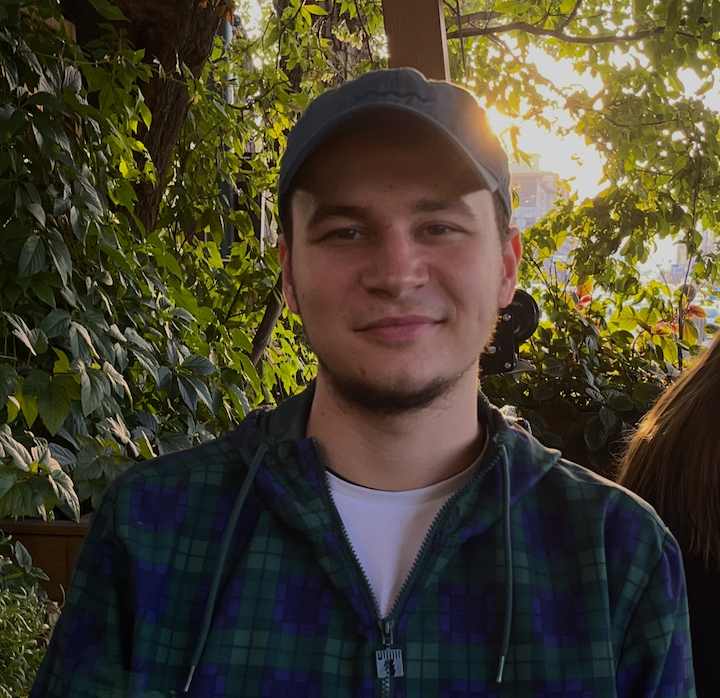

  

<h1 align="center" style="margin:10px 0; line-height:1.2; border-bottom:none; font-size:clamp(1.5rem, 5vw, 2.2rem); padding:0 12px;">
  Седнев Анатолий 
  
    JavaScript&nbsp;/&nbsp;Python Developer
  
</h1>

  <h2 style="font-size:clamp(1.4rem, 4vw, 2em); font-weight:bold; margin:20px 0; border-bottom:none;">
    Обо мне
  </h2>
  

    Занимаюсь разработкой на <strong>JavaScript</strong> и <strong>Python</strong>: веб-приложения, бэкенд, микросервисы, скрипты и автоматизация. Делаю парсеры, ботов, интеграции с API и сервисами, работу с данными и прототипы под ваши задачи.
  

  

    Важно для меня: чётко понять задачу, предложить адекватное решение и довести проект до результата. Готов обсуждать сроки и объём, подстраиваться под формат работы и держать связь по ходу дела.
  

  

    Ниже — примеры реализованных проектов. Опыта в программировании много, готов и к новым задачам — напишите: разберём задачу и обсудим сотрудничество.
  

<h2 align="center" style="font-size:clamp(1.4rem, 4vw, 2em); font-weight:bold; margin:20px 0; border-bottom:none; padding:0 12px;">
  Портфолио
</h2>

<h3 align="center" style="font-size:1.2em; font-weight:600; margin:24px 0 12px 0; padding:0 12px;">
  Бизнес-проекты
</h3>

  <table cellpadding="8" cellspacing="0" style="border-collapse:collapse; border:1px solid #ccc; width:100%; min-width:320px; overflow-wrap:break-word;">
    <thead>
      <tr>
        <th style="border:1px solid #ccc; padding:8px; background:#f6f8fa;">Проект</th>
        <th style="border:1px solid #ccc; padding:8px; background:#f6f8fa;">Описание</th>
        <th style="border:1px solid #ccc; padding:8px; background:#f6f8fa;">Ссылка</th>
      </tr>
    </thead>
    <tbody>
      <tr>
        <td style="border:1px solid #ccc; padding:8px;">Парсер</td>
        <td style="border:1px solid #ccc; padding:8px;">Парсер на Scrapy для сбора каталога товаров с www.ysl.com/en-en и загрузки данных в гугл-таблицу</td>
        <td style="border:1px solid #ccc; padding:8px;"><a href="https://github.com/telsamar/parser2/tree/main">GitHub</a></td>
      </tr>
      <tr>
        <td style="border:1px solid #ccc; padding:8px;">Парсер</td>
        <td style="border:1px solid #ccc; padding:8px;">Парсер сайта b2b.zip161.ru</td>
        <td style="border:1px solid #ccc; padding:8px;"><a href="https://github.com/telsamar/Parser">GitHub</a></td>
      </tr>
      <tr>
        <td style="border:1px solid #ccc; padding:8px;">Бот торговли на основе фандинга</td>
        <td style="border:1px solid #ccc; padding:8px;">Версия бота на основе фандинга по API Bybit, использование Docker</td>
        <td style="border:1px solid #ccc; padding:8px;"><a href="https://github.com/telsamar/FUND_BYBIT_1/tree/main">GitHub</a></td>
      </tr>
      <tr>
        <td style="border:1px solid #ccc; padding:8px;">Бот торговли на основе полос Боллинджера</td>
        <td style="border:1px solid #ccc; padding:8px;">Интеграция с API биржи, алгоритмы, анализ данных, Docker</td>
        <td style="border:1px solid #ccc; padding:8px;"><a href="https://github.com/telsamar/BolBands_BYBIT_2/tree/main">GitHub</a></td>
      </tr>
    </tbody>
  </table>

<h3 align="center" style="font-size:1.2em; font-weight:600; margin:24px 0 12px 0; padding:0 12px;">
  Заказы по учёбе (дипломы, НИРС, работы для студентов)
</h3>

  <table cellpadding="8" cellspacing="0" style="border-collapse:collapse; border:1px solid #ccc; width:100%; min-width:320px; overflow-wrap:break-word;">
    <thead>
      <tr>
        <th style="border:1px solid #ccc; padding:8px; background:#f6f8fa;">Проект</th>
        <th style="border:1px solid #ccc; padding:8px; background:#f6f8fa;">Описание</th>
        <th style="border:1px solid #ccc; padding:8px; background:#f6f8fa;">Ссылка</th>
      </tr>
    </thead>
    <tbody>
      <tr>
        <td style="border:1px solid #ccc; padding:8px;">Тестовое задание Data-аналитика</td>
        <td style="border:1px solid #ccc; padding:8px;">Выполнение тестового при трудоустройстве на должность Data-аналитика</td>
        <td style="border:1px solid #ccc; padding:8px;"><a href="https://github.com/telsamar/work-Backend-Python-Junior/tree/stable">GitHub</a></td>
      </tr>
      <tr>
        <td style="border:1px solid #ccc; padding:8px;">Тестовое задание Data-аналитика #2</td>
        <td style="border:1px solid #ccc; padding:8px;">Второе тестовое задание при трудоустройстве на должность Data-аналитика</td>
        <td style="border:1px solid #ccc; padding:8px;"><a href="https://github.com/telsamar/testhse/tree/main">GitHub</a></td>
      </tr>
      <tr>
        <td style="border:1px solid #ccc; padding:8px;">НИРС</td>
        <td style="border:1px solid #ccc; padding:8px;">Научно-исследовательская работа: определение лица на фотографии с помощью YOLO</td>
        <td style="border:1px solid #ccc; padding:8px;"><a href="https://github.com/telsamar/YOLOv8-nirs/tree/main">GitHub</a></td>
      </tr>
      <tr>
        <td style="border:1px solid #ccc; padding:8px;">Прогноз заявок на инсталляции</td>
        <td style="border:1px solid #ccc; padding:8px;">Модель прогнозирования заявок по адресам на день, неделю и месяц: нормализация адресов, исключения и коэффициенты по территориям, кластеризация в области по координатам, вывод в Excel. Консоль, меню и GUI для настройки конфига.</td>
        <td style="border:1px solid #ccc; padding:8px;"><a href="projects/zakaz/">проект в репозитории</a></td>
      </tr>
    </tbody>
  </table>

<h2 align="center" style="font-size:clamp(1.4rem, 4vw, 2em); font-weight:bold; margin:20px 0; border-bottom:none; padding:0 12px;">
  GitHub-активность
</h2>

  
  

  

  

    <code style="user-select:text;">sednev_a@internet.ru</code>
    
    — пишите!
  

  

    Последнее обновление: 16 февраля 2026
  

